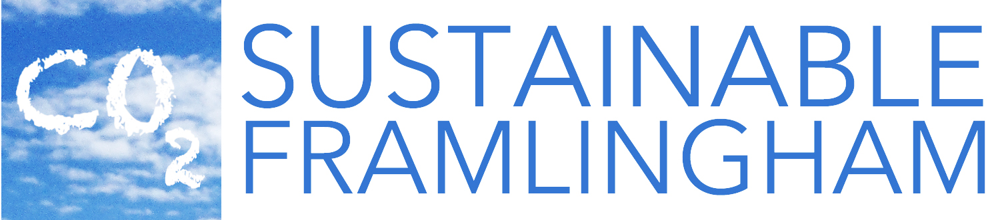

# About
Sustainable Framlingham is a volunteer group set up to advise the [Framlingham Town Council](https://framlingham.com/framlingham-town-council/) on sustainability issues covering:

 * Emissions reduction - reducing our 'carbon' footprint
 * Biodiversity enhancement - making space for nature
 * Least trace living - reducing waste and increasing re-use
 * Resilience - reducing the risks of climate change

Feel free to explore the repositories that have been set up to support various aspects of this work.
